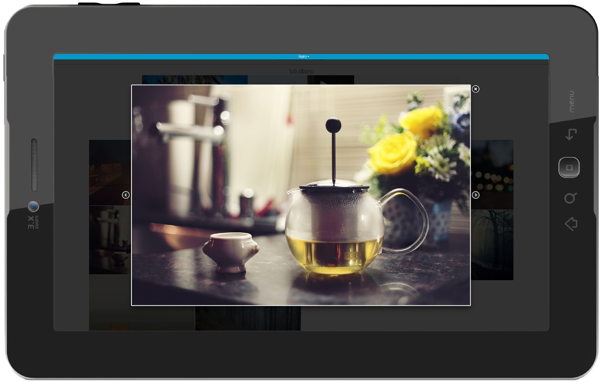

> Automated web photo albums for convenience lovers

[](https://github.com/BastiTee/pyntrest/releases/tag/1.0.0)
[](https://travis-ci.org/BastiTee/pyntrest)

## What is Pyntrest?

Pyntrest is a flat-file image CMS written in Python that automatically generates a fully fledged web photo album from a local folder without the necessity to do boring stuff like setting up databases, content management systems or creating thumbnails. Pyntrest is for convenience lovers like me.




### The basics

* Pyntrest uses a local folder and assumes that each (sub-) folder is a web photo album
* It will automatically scan for images and create web photo albums on request
* Web photo albums are browsable just like on your disk
* Albums and images are presented in fancy Pintrest-like canvas
* It's responsive, it lazy-loads images and it's minimalistic

Simple as that.

### The optional stuff

A limited number of options are available to enrich the basic image albums. All optional of course.

* You can provide a text file providing album and image descriptions and some configuration options
* YouTube videos can be embedded as well
* Each folder can serve additional blog-like content either as intro before your album/images or between images. Blog content can be provided as Markdown or HTML (or combined)

See the configuration section below for details on how to configure.

### Limitations

Pyntrest is focussed on simple web photo albums. It is neither a blog CMS, nor does it support social features or some kind of a plug-in architecture. If you just want to share some photos with your family and friends on your own server, then Pyntrest is for you. If you want more, consider checking out other awesome flat-file CMS like [Grav](https://getgrav.org/) or [Automad](http://automad.org/). 

## How to start

Basic instructions are as follows:

* Install Python 2.7.x (Python 3.* support is untested)
* Clone or download Pyntrest
* Go to Pyntrest's root folder and install dependencies by running `pip install -r requirements.txt` (assuming you have [pip](https://pypi.python.org/pypi/pip) installed, Attention: On unix you also need to have `gcc` and `python-devel` packages installed in order to compile `pillow`)
* _Recommended_: Run `python manage.py test` to test the installation (see next chapter for possible solutions on errors)
* Run `python manage.py runserver` (on image folders with lots of images this will take a while since Pyntrest performs a startup scan of your folder and creates all the necessary thumbnails)
* Open [http://localhost:8000](http://localhost:8000) in a browser and enjoy

The web photo album has been automatically generated from the local folder [`<pyntrest>/sample_images`](https://github.com/BastiTee/pyntrest/tree/master/sample_images). Of course you can also use your own images and brandings. For that please refer to [`<pyntrest>/pyntrest/pyntrest_config.py`](https://github.com/BastiTee/pyntrest/blob/master/pyntrest/pyntrest_config.py.default) and change the settings as you desire.

Pyntrest is fully compatible with wsgi servers like unicorn or Apache using mod_wsgi. Hence it is possible to use it in combination with production servers.

For folder or file management, i.e., the actual content management, you can use whatever you want to use (Dropbox, Drive, FTP, etc.) I use Dropbox to synchronize a folder on my webspace with my mobile device. If the image arrives at the webspace's folder, Pyntrest automatically detects the picture and it's instantly available on the corresponding web photo album. The same applies to new subalbums, optional album info files or youtube hooks.

## Options  

### Album/image information

To enable album/image information you need to create a [`__info__.txt`](https://github.com/BastiTee/pyntrest/blob/master/sample_images/__info__.txt) file in your image (sub-) folder. It is used to provide information such as title, description, a cover image and details for individual photos or videos. The following options can be set.

**AlbumInfo Section**

In the album info section you can provide detailed information about the album itself. The section is labeled `[AlbumInfo]`. After the section label you can provide various options in the form `<Key>=<Value>` to configure the album. Valid options are:

* `Title` - Title of the album. Will appear in the album header.
* `Description` - Short description of the album. Will appear in the album header.
* `CoverImage` - Image to be used as album cover. If not set, the first image will be used. If no image is available, then a placeholder will be created.
* `HideCover` - Allowed values are `True` or `False`. If set to true, the cover image will not appear within the sub album. If not set or set to false, the default (cover not hidden) will be used.  
* `ReverseImages` - Allowed values are `True` or `False`. If set to true, the album images will be sorted in descending order. If not set or set to false, the default (ascending order) will be used. This has no effect on the folders within the album.
* `ModifiedAlbumsOnTop` - Allowed values are `True` or `False`. If set to true, the sub album folders will be sorted so that the album is on top that was modified or created last. If not set or set to false, the default order (ascending by name) will be used. This has no effect on the images within the album.

```
[AlbumInfo]
Title=Pyntrest
Description=Automated web photo albums for convenience lovers
CoverImage=im-001.jpg
HideCover=False
ReverseImages=True
ModifiedAlbumsOnTop=False
```

**ImageInfo Section**

In the image info section you can provide details for individual photos. The section is labeled `[ImageInfo]`. After the section label you can simply provide `<Image-Filename>=<Your-Description>` to add an image description.

```
[ImageInfo]
image-01.jpg=My favourite image!
im-0041.youtube.ini=This funny video was made in 2009.
image-02.jpeg=Oh! Look at Johnnys face :)
```

### YouTube hooks

To add a YouTube hook you need to create a file with a name

* having the desired YouTube id enclosed with the `%` symbol
* ending with `__youtube__.txt`

Example: [`im-0041-%6dk-5HN4fvg%__youtube__.txt`](https://github.com/BastiTee/pyntrest/blob/master/sample_images/im-0041-%256dk-5HN4fvg%25__youtube__.txt).

### Album introductions

To add an album introduction you need to create a file named [`__intro__.txt`](https://github.com/BastiTee/pyntrest/blob/master/sample_images/blog-example/__intro__.txt) in your image (sub-) folder. This file can contain Markdown and/or HTML and will be rendered to a webpage. Assuming you have the Pyntrest sample application running, you can see an example at [http://localhost:8000/blog-example](http://localhost:8000/blog-example)

### In-between blogs

You can also add blogs in between images. For this you need to create a file with a name that ends with `__blog__.txt`. Like album introductions this file can contain Markdown and/or HTML and will be rendered to a webpage. The first line of the file will be used as blog title. Assuming you have the Pyntrest sample application running, you can see two examples in the root folder [http://localhost:8000/](http://localhost:8000/), i.e., ["The power of markdown"](https://github.com/BastiTee/pyntrest/blob/master/sample_images/im-005__blog__.txt) and ["What is Python?"](https://github.com/BastiTee/pyntrest/blob/master/sample_images/im-009__blog__.txt).

## Troubleshooting

### Common problems on startup

 * If tests fail with an error like the one below, then you need to install `libjpeg-devel` for your platform and rerun the Pillow installation

```
E.........EEEE.E
======================================================================
ERROR: test (pyntrest_tests.test_pyntrest_core.CoreTestSuite)
----------------------------------------------------------------------
Traceback (most recent call last):
  ...
IOError: decoder jpeg not available
```

## Project info

Pyntrest relies on a number of awesome open source projects:

* [Python](https://www.python.org/)
* [Django web framework](https://pypi.python.org/pypi/Django)
* [Pillow - Python Image Library (PIL) fork](https://pypi.python.org/pypi/Pillow)
* [markdown2 - Markdown in Python](https://github.com/trentm/python-markdown2)
* [jQuery](http://jquery.com/)
* [Masonry - Cascading grid layout library](http://masonry.desandro.com/)
* [fancyBox - Fancy jQuery Lightbox Alternative](http://fancyapps.com/fancybox/)
* [jQuery Lazy - Delayed image loading plugin for jQuery](http://jquery.eisbehr.de/lazy/)
* [FontAwesome - The iconic font and CSS toolkit](http://fontawesome.io)
* [html5-boilerplate](https://github.com/h5bp/html5-boilerplate)

Furthermore I've incorporated numerous images for testing purposes. All those images are licensed under [CC0 1.0 Universal (CC0 1.0) ](http://creativecommons.org/publicdomain/zero/1.0/) and were fetched at http://unsplash.com/

Pyntrest is licensed under [GPLv3](http://www.gnu.org/licenses/gpl.html).
