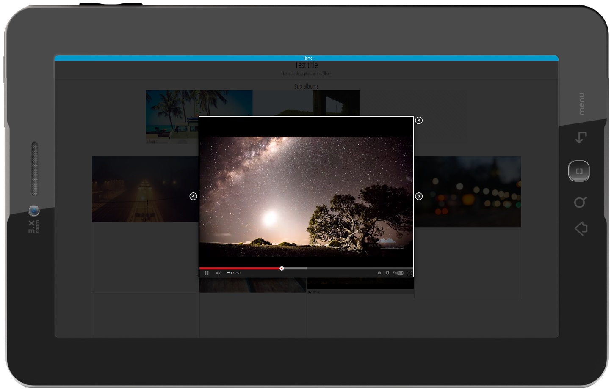

> Automated web photo albums for convenience lovers

Pyntrest is a Python/Django-based application that automatically generates a fully fledged web photo album from a local folder without the necessity to do boring stuff like setting up databases, content management systems or creating thumbnails. Pyntrest is for convenience lovers like me. 

### The basics

* Pyntrest uses a local folder and assumes that each (sub-) folder is a web photo album 
* It will automatically scan for images and create web photo albums on request 
* Web photo albums are browsable just like on your disk
* Albums and images are presented in fancy Pintrest-like canvas
* It's responsive and minimalistic 
* It lazy-loads images which is nice for the user's bandwidth

### The optional stuff

* An info.ini file can be created per web photo album to provide more information such as title, description or a cover image
* It supports embedding YouTube videos by providing the youtube id of the video in a text file
* Anything that Pyntrest relies on will be generated but if you decide to you can create thumbnails etc. yourself

For folder or file management, i.e., the actual content management, you can use whatever you want to use (Dropbox, Drive, FTP, etc.) I, for example, use Dropbox to synchronize a folder on my webspace with my mobile device. If the image arrives at the webspace's folder, Pyntrest automatically detects the picture and it's instantly available on the corresponding web photo album. The same applies to new subalbums, optional album info files or youtube hooks.

## How to start

Basic instructions are as follows:

* Install Python 2.7.x
* Clone or download Pyntrest
* Go to the downloaded folder do one of the following
 * run `pip install -r requirements.txt` (assuming you have [pip](https://pypi.python.org/pypi/pip) installed. Attention: On unix you also need to have `gcc` and `python-devel` packages installed in order to compile `pillow`)
 * manually install [Django web framework](https://pypi.python.org/pypi/Django) and [Pillow](https://pypi.python.org/pypi/Pillow) (please refer to `requirements.txt` for correct versions, you can also use PIL instead of Pillow if you prefer)
* Run `python manage.py runserver` (on image folders with lots of images this will take a while since Pyntrest performs a startup scan of your folder and creates all the necessary thumbnails)
* Open `http://localhost:8000` in a browser and enjoy

What you should see is a web photo album that is automatically generated from the local folder `<pyntrest>/sample_images`. Of course you can also use your own images and brandings. For that please refer to `<pyntrest>/pyntrest/pyntrest_config.py` and change the settings as you desire. Pyntrest is fully compatible with wsgi servers like unicorn or Apache using mod_wsgi. Hence it is possible to use it in combination with production servers. 

## Project info

Pyntrest relies on a number of awesome open source projects:

* [Python](https://www.python.org/)
* [Django web framework](https://pypi.python.org/pypi/Django)
* [Pillow - Python Image Library (PIL) fork](https://pypi.python.org/pypi/Pillow)
* [jQuery](http://jquery.com/)
* [Masonry - Cascading grid layout library](http://masonry.desandro.com/)
* [fancyBox - Fancy jQuery Lightbox Alternative](http://fancyapps.com/fancybox/)
* [jQuery Lazy - Delayed image loading plugin for jQuery](http://jquery.eisbehr.de/lazy/)
* [html5-boilerplate](https://github.com/h5bp/html5-boilerplate)

Furthermore I've incorporated numerous images for testing purposes. All those images are licensed under [CC0 1.0 Universal (CC0 1.0) ](http://creativecommons.org/publicdomain/zero/1.0/) and were fetched at http://unsplash.com/

Pyntrest is licensed under [Apache Licence v2](http://www.apache.org/licenses/LICENSE-2.0.html). 

## Screenshots

Below you find the latest screenshots of Pyntrest.

